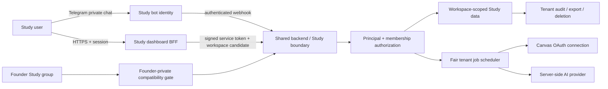

# Public Study architecture

Date: 2026-08-17 SGT  
Status: **approved architecture; no runtime activation, migration, bot creation, or deployment**

This is the canonical Phase 7 design for turning the sealed founder-only Study Mode into a
separately branded, multi-tenant product. It is deliberately additive. The existing founder
workspace remains private and fail-closed until a staged migration proves that the new tenant
boundaries are at least as strong as the current environment gate.

The companion documents are:

- [`PUBLIC_STUDY_THREAT_MODEL.md`](PUBLIC_STUDY_THREAT_MODEL.md)
- [`PUBLIC_STUDY_ROLLOUT.md`](PUBLIC_STUDY_ROLLOUT.md)
- the dashboard boundary contract in the dashboard repository at
  `docs/PUBLIC_STUDY_DASHBOARD_BOUNDARY.md`

## 1. Decisions at a glance

| Concern | Decision |
| --- | --- |
| Product identity | A separate Study Telegram bot, webhook path, secret, command menu, branding, and operational kill switch. The backend process and PostgreSQL cluster may be shared initially. |
| Default social model | Private-chat-first. A user's academic data is not placed in a Telegram group by default. Collaborative Study spaces are a later, explicit-consent capability. |
| Tenant boundary | `StudyWorkspace` is the tenant data boundary. Every request, row, job, cache key, lease, quota, audit event, export, and deletion operation is resolved through a verified principal and workspace membership. |
| Founder workspace | Preserved as a `FOUNDER_PRIVATE` workspace behind the current owner/chat gate during migration. No public code path can select it. |
| Membership | Durable `StudyMembership` rows with `OWNER`, `ADMIN`, and `MEMBER` roles. Authorization is server-side, action-specific, and fail-closed. Telegram group-admin status is not the public Study source of truth. |
| Canvas | OAuth authorization-code flow with an institution-issued, scoped developer key. Credentials are per connection, encrypted at rest, revocable, rotatable, and never entered through Telegram or exposed to browser JavaScript. |
| AI | A service-owned provider key remains server-side. Analysis is opt-in, quota-bound, evidence-bounded, workspace-scoped, and disclosed as third-party processing. It is not end-to-end encrypted. |
| Encryption | Envelope encryption for Canvas credential material and the existing field-level encryption policy for private content. Decryption occurs only in the owning server job/request boundary. |
| Scheduling | Durable workspace-scoped jobs with leases and idempotency keys. A fair scheduler enforces per-tenant concurrency, quotas, provider cooldowns, and global safety limits. |
| Dashboard | Continue using a BFF. Browser cookies select only a candidate workspace; the backend independently resolves membership and authorization on every operation. |
| Launch | Invite-only staging cohort first. General availability is blocked by Phase 6 F-01–F-03, hosted synthetic staging, restore/key-recovery evidence, tenant-isolation tests, and an incident/rollback rehearsal. |

## 2. Current implementation and migration seam

The design is grounded in the current code rather than assuming a greenfield rewrite:

- `prisma/schema.prisma:340-438` has one `User.studyWorkspace` and a `StudyWorkspace` with
  unique `ownerUserId`, `ownerTelegramId`, and `boundChatId`. Most child tables already carry
  `workspaceId`, which is the strongest reusable seam.
- `src/services/study.ts:46-62` and `:151-236` authorize exactly one environment-configured
  owner and group. `activeStudyWorkspace()` is process-global and feeds reminders and Canvas.
- `src/dashboard/workspaces.ts` and `src/dashboard/study.ts:315-338` repeat the configured
  owner/chat gate. This is intentionally safe for the founder installation but is not tenancy.
- `src/config/env.ts:71-74` supplies the singleton owner, chat, Canvas token, and Canvas base URL.
- `src/services/studyCanvas.ts` serializes sync globally and reads the global Canvas token.
- `src/services/studyReminders.ts:52-109` runs one active workspace through the primary bot.
- `src/main.ts` already hosts isolated Threadwise and Beacon bot identities. That is the
  operational precedent for a third, separately branded Study bot.
- The dashboard BFF signs a short-lived service token and forwards a selected workspace header.
  The backend remains responsible for resolving the principal and workspace.

The public architecture therefore adds identity, membership, connection, bot-binding, quota,
and job-control primitives without rewriting the mature Study content tables.

## 3. Target trust and request flow



Security rules:

1. Bot identity is part of the inbound principal context. A Threadwise update cannot be
   reinterpreted as a Study-bot update.
2. A user-supplied workspace id is only a lookup candidate. Authorization returns a canonical
   `(principalUserId, workspaceId, membershipId, role, botInstallationId?)` scope.
3. Domain services receive that scope or a narrower capability. They do not accept a naked
   workspace id from request data for privileged operations.
4. Persistence queries include `workspaceId`; cross-workspace identifiers return an opaque
   not-found response.
5. Provider credentials are selected by an authorized connection id belonging to that same
   workspace. No caller can provide a token or arbitrary provider base URL.

## 4. Tenant identity and authorization

### 4.1 Durable principals

`User` remains the human identity anchored to Telegram. Public Study should add a durable product
profile instead of using environment variables as identity:

```prisma
enum StudyWorkspaceKind {
  FOUNDER_PRIVATE
  PERSONAL
  COLLABORATIVE
}

enum StudyWorkspaceRole {
  OWNER
  ADMIN
  MEMBER
}

enum StudyMembershipStatus {
  INVITED
  ACTIVE
  SUSPENDED
  REMOVED
}

model StudyWorkspace {
  // Existing Study fields remain.
  kind              StudyWorkspaceKind @default(PERSONAL)
  slug              String?            @unique
  deletionState     String              @default("ACTIVE")
  deletedAt         DateTime?
  memberships       StudyMembership[]
  botBindings       StudyBotBinding[]
  canvasConnections StudyCanvasConnection[]
  quotaState        StudyQuotaState?
}

model StudyMembership {
  id          String                @id @default(uuid())
  workspaceId String
  userId      String
  role        StudyWorkspaceRole
  status      StudyMembershipStatus @default(ACTIVE)
  invitedById String?
  joinedAt    DateTime?
  removedAt   DateTime?
  createdAt   DateTime              @default(now())
  updatedAt   DateTime              @updatedAt

  workspace StudyWorkspace @relation(fields: [workspaceId], references: [id], onDelete: Cascade)
  user      User           @relation(fields: [userId], references: [id], onDelete: Cascade)

  @@unique([workspaceId, userId])
  @@index([userId, status, updatedAt])
  @@index([workspaceId, role, status])
}
```

The concrete migration may retain `ownerUserId` as a denormalized invariant during transition,
but `ownerTelegramId` must stop being the authorization key for public workspaces. Exactly one
active owner is enforced transactionally. Ownership transfer requires step-up confirmation,
cannot remove the final owner, and writes an immutable audit event.

### 4.2 Authorization capabilities

Roles are inputs to capability checks, not permissions scattered through UI conditionals.

| Capability | Owner | Admin | Member |
| --- | ---: | ---: | ---: |
| Read personal Study content | Yes | Only collaborative, with explicit membership | Only collaborative, with explicit membership |
| Create/update own Study content | Yes | Yes in collaborative workspace | Yes where workspace policy allows |
| Connect or disconnect own Canvas account | Yes | Yes for self | Yes for self |
| Use another member's Canvas connection | No by default | No by default | No |
| Manage membership/policy/quota tier | Yes | Limited membership administration | No |
| Export entire workspace | Yes | Policy-controlled | Own contributed data only by default |
| Delete workspace | Yes with re-authentication and grace period | No | No |

Every protected service starts with a helper conceptually equivalent to:

```ts
const scope = await authorizeStudyAction({
  principal,
  requestedWorkspaceId,
  action: "study.resource.update",
  resourceId,
});
```

The helper resolves active membership, workspace lifecycle, role/capability, object ownership,
and any bot binding. It returns the canonical tenant scope or an opaque denial. UI visibility is
never accepted as authorization.

### 4.3 Founder compatibility adapter

The existing founder workspace is backfilled as `FOUNDER_PRIVATE` with one owner membership. Its
legacy Telegram group continues through the current `STUDY_OWNER_TELEGRAM_ID` and
`STUDY_ALLOWED_CHAT_ID` checks until the owner explicitly completes a shadow migration. Public bot
handlers reject `FOUNDER_PRIVATE` workspaces. The legacy environment variables are removed only
after both old and new paths produce identical authorization evidence and rollback is proven.

## 5. Bot isolation

Add an application-level bot identity rather than branching only on which token happened to start
the process:

```prisma
model TelegramBotInstallation {
  id            String   @id @default(uuid())
  product       String   // THREADWISE, STUDY, BEACON
  telegramBotId String   @unique
  username      String?
  webhookKeyId  String
  active        Boolean  @default(true)
  createdAt     DateTime @default(now())
  updatedAt     DateTime @updatedAt
}

model StudyBotBinding {
  id                String   @id @default(uuid())
  workspaceId       String
  botInstallationId String
  telegramChatId    String
  chatKind          String   // PRIVATE by default
  active            Boolean  @default(true)
  createdAt         DateTime @default(now())
  updatedAt         DateTime @updatedAt

  @@unique([botInstallationId, telegramChatId])
  @@index([workspaceId, active])
}
```

Bot tokens and webhook secrets remain deployment secrets, not database fields. The database stores
only stable bot identifiers and a secret/key version reference. Each webhook route validates its
own secret before grammY sees the update, uses a product-specific processed-update namespace, and
has independent rate limits and a kill switch. Command menus, deep links, telemetry labels, and
error budgets are separate. A Study outage must not take down Threadwise or Beacon handlers.

## 6. Canvas OAuth and credential custody

Canvas states that access tokens are password-equivalent, multi-user applications must use OAuth,
and developer keys can be scoped by endpoint. Public Study must therefore never ask users to paste
manual tokens into Telegram, the dashboard, or global environment variables. If the institution
does not grant an appropriate developer key, public Study launches without Canvas sync.

### 6.1 Connection model

```prisma
enum StudyConnectionStatus {
  PENDING
  ACTIVE
  NEEDS_REAUTH
  REVOKED
  ERROR
}

model StudyCanvasConnection {
  id                       String   @id @default(uuid())
  workspaceId              String
  userId                   String
  canvasOrigin             String
  canvasUserId             String?
  canvasUserName           String?
  accessTokenCiphertext    String
  refreshTokenCiphertext   String
  credentialKeyVersion     String
  accessTokenExpiresAt     DateTime
  grantedScopes            String[]
  status                   StudyConnectionStatus @default(PENDING)
  lastUsedAt               DateTime?
  lastSuccessfulRefreshAt  DateTime?
  revokedAt                DateTime?
  createdAt                DateTime @default(now())
  updatedAt                DateTime @updatedAt

  @@unique([workspaceId, userId, canvasOrigin])
  @@index([status, accessTokenExpiresAt])
  @@index([workspaceId, status])
}
```

The production migration should add an explicit `connectionId` to Canvas sync/material provenance
where multiple member connections are supported. A personal workspace normally has one active
connection. A collaborative workspace must never silently merge member-private LMS data; import
requires an explicit sharing policy and records which connection supplied each item.

### 6.2 OAuth flow

1. An authenticated dashboard user starts a connection for an allowlisted institution origin.
2. The backend creates a short-lived, single-use state record bound to user, workspace, origin,
   PKCE verifier, intended redirect, and expiry.
3. The browser is redirected to the institution's Canvas authorization endpoint using the minimum
   developer-key scopes needed for courses, modules, files/pages metadata, assignments, and the
   user's submissions.
4. The callback validates state once, validates the configured canonical origin, exchanges the
   code server-side, verifies the returned Canvas identity, encrypts token material, and stores only
   safe metadata in logs/audit.
5. Refresh is serialized per connection and compare-and-swaps the credential version. A `401` with
   Canvas's authentication signal transitions to `NEEDS_REAUTH`; it never causes a token dump.
6. Disconnect first attempts Canvas token revocation, then irreversibly removes local credential
   ciphertext and cancels queued jobs for that connection. Provider failure is recorded safely and
   local deletion still completes according to policy.

### 6.3 Encryption and outbound request rules

- Use authenticated envelope encryption (for example, a vetted AES-256-GCM implementation) with a
  per-record data-encryption key and a versioned deployment-held key-encryption key. Never invent a
  custom cipher or derive credential encryption from user passwords.
- Bind associated data to connection id, workspace id, user id, provider, and key version so
  ciphertext cannot be moved between tenants unnoticed.
- Decrypt only immediately before a provider call, keep plaintext out of job payloads/logs/errors,
  and release references promptly. Background jobs carry `connectionId`, never token material.
- Canonicalize and allowlist the Canvas origin during connection. Every API request and pagination
  link must remain HTTPS and same-origin. This is also the required remediation for Phase 6 F-01.
- Treat Canvas `Link` URLs as opaque path/query values only after validating their origin; do not
  forward authorization across redirects.

Official references:

- Canvas OAuth overview: https://developerdocs.instructure.com/services/canvas/oauth2/file.oauth
- Canvas developer keys and scopes: https://developerdocs.instructure.com/services/canvas/oauth2/file.developer_keys
- Canvas pagination: https://developerdocs.instructure.com/services/canvas/basics/file.pagination

## 7. Tenant-scoped background work and fair scheduling

All heavy work uses a common job envelope even if domain tables remain separate:

```text
jobId, kind, workspaceId, principalUserId, connectionId?, botInstallationId?,
idempotencyKey, status, priorityClass, notBefore, attemptCount, maxAttempts,
leaseOwner, leaseExpiresAt, costEstimate, createdAt, completedAt, safeErrorCode
```

Required invariants:

- A unique `(workspaceId, kind, idempotencyKey)` prevents duplicate user intent.
- Claims include `workspaceId` and use an expiring lease with compare-and-swap ownership.
- Retries are bounded, jittered, and provider-aware. Permanent authentication failures do not spin.
- The scheduler uses deficit round-robin or an equivalently testable fair policy across active
  workspaces, then priority within a workspace. One large tenant cannot monopolize Canvas or AI.
- Enforce global concurrency, per-provider concurrency, per-workspace concurrency, and per-user
  concurrency. Values are configuration/policy data with safe defaults, not user-controlled numbers.
- Queue depth and old-job age trigger admission control before the provider is overwhelmed.
- Worker logs use opaque job/workspace references or hashes and safe error codes; they never include
  prompts, note bodies, OCR text, Canvas tokens, authorization headers, or provider responses.

### 7.1 Quotas and rate limits

Start with route classes instead of one universal limit:

| Class | Examples | Key | Policy shape |
| --- | --- | --- | --- |
| Authentication | login/callback, bot linking | IP plus account candidate | strict burst and failure window |
| Read-light | snapshot metadata, modules | principal + workspace | moderate burst, cached safe metadata where valid |
| Search/content | note body, search, media | principal + workspace | lower burst, byte budget |
| Mutation | notes, plans, settings | principal + workspace | idempotency-aware, replay-protected |
| Expensive | Canvas sync, AI analysis, OCR | principal + workspace + operation | low concurrency, daily/monthly quota, queue admission |
| Webhook | Study bot update | bot installation + chat/user after secret validation | bounded burst plus update-id dedupe |

Use a durable or shared bounded rate-limit store appropriate to multi-instance deployment; never an
unbounded process-local map. This is the public architecture dependency on Phase 6 F-03. Mutation
service JWTs also require the chosen Phase 6 F-02 replay/idempotency control.

## 8. Data lifecycle, audit, export, and deletion

### 8.1 Audit

Introduce a Study-specific audit envelope (or extend `AuditLog`) with `workspaceId`, actor user,
membership/role snapshot, action, target type/id, request correlation id, bot installation, outcome,
and safe structured metadata. Do not store note bodies, prompts, OCR, tokens, authorization headers,
or raw provider errors. Security events have a defined retention period and access policy; product
activity is not silently repurposed for surveillance.

### 8.2 Export

The existing six-CSV Telegram export is useful but not a complete portability contract. Public
Study export must be a leased, restart-safe job producing a bounded archive manifest plus JSON/CSV
or Markdown assets for all user-visible Study records, revisions, links, Canvas-derived metadata,
analysis results/suggestions, preferences, and safe audit history. It excludes secrets, internal
leases, provider tokens, blind search tokens, and other members' private provider data. The archive
is encrypted at rest while pending, delivered through a short-lived authenticated download, and
deleted after a stated retention window.

### 8.3 Deletion

Account and workspace deletion are explicit workflows, not one unbounded request transaction:

1. Re-authenticate and show the exact scope (personal workspace, collaborative membership, or full
   workspace ownership).
2. Place the target in `DELETION_PENDING`, revoke new jobs, disable bot delivery, and create a
   single idempotent deletion operation with a grace deadline.
3. Offer export during the grace period. Allow cancellation by an authorized owner.
4. At execution, revoke/delete Canvas credentials first, cancel leases, remove derived media and
   provider references, then cascade tenant data in bounded batches or a proven transaction plan.
5. Write a minimal, non-content deletion receipt and tombstone required for replay/abuse safety.
   Do not retain private content merely to prove deletion.
6. Collaborative deletion requires sole-owner or approved ownership-transfer rules. Leaving a
   workspace removes membership and personal credentials without deleting others' data.

Destructive deletion testing uses synthetic staging tenants only until a separately approved,
bounded production verification exists.

## 9. AI, privacy, and client-side encryption boundary

Public Study can support evidence-grounded misconception correction, note-edit suggestions,
connections, and quizzes without turning AI into the canonical control path. The existing rules
remain: deterministic state changes, explicit user review before note edits, bounded evidence,
citations, validation, and cached results that remain readable during provider outages.

Consent must explain which material is sent to the provider, the purpose, retention policy, and how
to disable or delete results. Quotas prevent one tenant from exhausting the service-owned key.

Full client-side/end-to-end encryption is incompatible with server-side Canvas sync, full-text
search, reminders derived from note content, OCR, and AI analysis unless plaintext or keys are made
available to the server. Threadwise must not claim E2EE for those features. The selected model is:

- TLS in transit;
- server-side field/envelope encryption at rest;
- narrowly scoped decryption in authenticated requests/jobs;
- minimized retained diagnostics;
- optional future E2EE vaults only for content excluded from server search, reminders, OCR, Canvas,
  collaboration, and AI.

This is a deliberate product trade-off, not a hidden limitation.

## 10. Dashboard and API boundary

The browser continues to authenticate to a separate dashboard BFF with an HttpOnly session. The BFF
creates a short-lived backend token. The public design extends that token or request signature with
a stable session/principal reference while treating the workspace header as untrusted input.

Backend route pattern:

1. verify token issuer, audience, expiry, subject, JTI/replay policy, method/path/body binding where
   selected by Phase 6 remediation;
2. resolve user from subject;
3. resolve requested workspace and active membership;
4. authorize the named capability;
5. execute a tenant-scoped query/mutation with runtime schema validation;
6. return `private, no-store` and an opaque error for cross-tenant identifiers;
7. record safe audit/rate-limit outcomes.

Study routes should move from a founder-mode discriminator attached to a group workspace to an
explicit Study workspace id returned by authorized workspace discovery. The dashboard contract is
defined in the companion dashboard document.

## 11. Observability and operations

Required per-product signals are aggregates, not private content:

- active/invited/suspended tenants and memberships;
- webhook rejection/duplicate/latency by bot installation;
- rate-limit and quota decisions by route class/tier;
- queue depth, oldest age, lease recovery, retries, and fairness distribution;
- Canvas sync success, reauth-required, throttle, page/item counts, and safe error categories;
- AI request success, latency, validation failure, model/fallback, bounded token/cost estimates;
- export/deletion lifecycle and credential revocation outcome;
- authorization denials and cross-tenant canary failures without raw identifiers/content.

Operational kill switches exist for new invitations, Canvas sync, AI analysis, outbound reminders,
and the Study bot as independent controls. Health checks must not decrypt credentials or query user
content.

## 12. Additive migration sequence

1. **Foundations only:** add tenant kind, memberships, bot installations/bindings, encrypted Canvas
   connection metadata, quota policy/state, and durable audit/job fields. Feature flags default off.
2. **Founder backfill:** create the founder membership and legacy bot binding without changing the
   current gate. Validate row counts, relationships, and rollback on a restored database first.
3. **Dual authorization shadow:** compute new authorization decisions beside the legacy gate and
   compare safe allow/deny outcomes. Do not let shadow results authorize requests.
4. **Tenant service conversion:** make every Study service accept canonical scope; eliminate
   `activeStudyWorkspace()` and global Canvas token use from public paths. Keep founder adapter.
5. **Separate Study bot and BFF surface:** provision synthetic secrets in hosted staging, register
   the isolated webhook, and test product-specific update namespaces and kill switches.
6. **Invited cohort:** migrate only synthetic and explicitly invited accounts. Founder workspace
   remains on the legacy gate until the owner approves its cutover.
7. **Founder cutover and legacy retirement:** only after parity, rollback rehearsal, export/delete,
   and cohort evidence pass. Remove global Study identity/Canvas variables in a later cleanup release.

Each schema/backfill step requires the existing Gate 3A backup, isolated restore, and independent
encryption-key recovery evidence before production apply.

## 13. Phase 7 completion and implementation gates

This architecture phase is complete when these documents are reviewed, internally consistent, and
published on guarded branches. It does **not** authorize implementation or launch.

The first implementation slice should be tenant foundations only: additive membership/workspace
kind models, centralized authorization interfaces, and founder shadow tests. It must not include
Canvas OAuth, public bot activation, or data migration in the same change.

Public cohort entry requires all of the following:

- Phase 6 F-01, F-02, and F-03 remediated and retested;
- remote ephemeral PostgreSQL CI passing;
- dedicated hosted staging database, secrets, Study bot, provider test accounts, and synthetic data;
- Gate 3A backup/restore/key-recovery evidence for migrations;
- cross-tenant IDOR tests for every Study route and object type;
- Canvas OAuth, refresh, revoke, same-origin pagination, and credential rotation tests;
- fair scheduling, quota, lease recovery, and abuse tests;
- export, leave, disconnect, and destructive synthetic deletion rehearsals;
- privacy notice/consent, incident response, support, and rollback playbooks;
- an invite-only cohort approval recorded separately.

## 14. Explicit non-goals

- No public bot is created or registered in Phase 7.
- No friend is asked for a Canvas token or credential.
- No production secret, database row, provider response, or private Study content is inspected.
- No founder gate is relaxed, migrated, merged, or deployed.
- No claim is made that server-side encrypted Study data is end-to-end encrypted.
- Collaborative classrooms, institutional admin dashboards, billing, and multi-institution Canvas
  federation are future product phases, not hidden scope in the initial personal beta.
