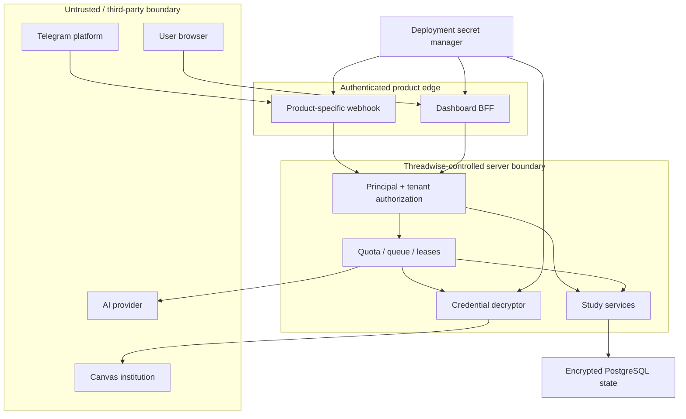

# Public Study privacy and threat model

Date: 2026-08-17 SGT  
Status: **Phase 7 design review; no active testing or remediation performed here**

This threat model applies to the proposed public, separately branded Study product described in
[`PUBLIC_STUDY_ARCHITECTURE.md`](PUBLIC_STUDY_ARCHITECTURE.md). It does not replace the Phase 6
assurance report, and it does not authorize attacks against production.

## 1. Security and privacy objectives

1. One user or workspace cannot discover, read, mutate, export, analyze, remind from, or delete
   another workspace's data.
2. Telegram, dashboard, Canvas, and AI identities cannot be confused across products or tenants.
3. Canvas credentials remain confidential, revocable, rotatable, origin-bound, and absent from
   browser JavaScript, Telegram messages, job payloads, logs, and exports.
4. Private academic content is minimized, encrypted at rest, decrypted only in an authorized
   request/job boundary, and retained only for a stated purpose and period.
5. Expensive provider and scheduler work remains fair and available under misuse or tenant growth.
6. Export, disconnect, leave, and deletion are complete, idempotent, observable, and recoverable
   until the explicit irreversible boundary.
7. The founder workspace remains no less private during migration than it is today.

## 2. Data classification

| Class | Examples | Handling |
| --- | --- | --- |
| Secret | Canvas access/refresh tokens, OAuth client secret, bot tokens, webhook secrets, encryption keys, signing keys | Secret manager or encrypted credential store only; never logs, browser, Telegram, exports, analytics, or documentation |
| Highly sensitive | Note/OCR bodies, image captures, study results, misconceptions, AI evidence/prompts/results, session reflections, unpublished course material | Tenant-scoped authorization; TLS; encrypted at rest; bounded processing; explicit AI disclosure/consent; retention and deletion |
| Sensitive metadata | Course/module names, assignments, due dates, study schedule, Canvas identity, file names, Telegram ids, workspace membership, audit events | Tenant-scoped; minimized logs; export/delete policy; avoid public identifiers |
| Operational metadata | Safe error code, queue age, attempts, model name, byte/item counts, rate-limit outcome | Structured and redacted; aggregated where possible; retention-bounded |
| Public | Product help, privacy notice, command descriptions, status page without tenant data | May be cached/published after review |

Provider-derived data remains untrusted even when it came from Canvas or AI. It can contain stored
attacker content, misleading instructions, oversized values, or hostile URLs.

## 3. Actors and trust boundaries

### Legitimate actors

- Study user and workspace owner
- invited workspace admin/member
- Threadwise operator with narrowly scoped operational access
- Study bot, dashboard BFF, backend workers
- Canvas institution and OpenAI provider

### Adversarial or failure actors

- unauthenticated internet client
- malicious or compromised Study account
- malicious member of a collaborative workspace
- attacker with a captured browser session or short-lived service token
- forged Telegram update or confused bot webhook
- compromised/misconfigured Canvas origin, proxy, or pagination response
- malicious note, Markdown, Mermaid, Canvas page/file metadata, or AI output
- dependency/supply-chain compromise
- operator error, leaked deployment secret, broken key rotation, or incomplete deletion
- noisy tenant attempting resource exhaustion or cost abuse

### Trust boundaries

The backend and operators are inside the server trust boundary; therefore server-side encryption
is not end-to-end encryption. Canvas and AI calls expose the minimum required plaintext to those
providers for the selected feature.

## 4. Threat register and required controls

| ID | Threat | Impact | Required preventive/detective controls | Verification |
| --- | --- | --- | --- | --- |
| TM-01 | Workspace id or object id is changed to another tenant (IDOR) | Cross-tenant read/write/delete | Central capability authorization; canonical membership scope; every query includes `workspaceId`; opaque not-found; cross-tenant foreign-key/invariant checks | Route/object matrix using two synthetic tenants for every CRUD/search/media/export endpoint |
| TM-02 | Frontend role/UI gate is treated as authority | Privilege escalation | Server-side authorization on every action; UI is UX only; fresh membership status for privileged changes | Direct API calls without UI; removed/suspended membership tests |
| TM-03 | Threadwise, Study, or Beacon webhook/update identity is confused | Commands execute in wrong product or tenant | Separate bot token, webhook secret/path, bot installation id, command menu, update dedupe namespace, kill switch | Wrong-secret, wrong-route, cross-bot replay, duplicate update tests |
| TM-04 | Captured dashboard service JWT is replayed | Duplicate mutation or unauthorized short-window reuse | Resolve Phase 6 F-02 with durable mutation replay/idempotency policy; bind claims where selected; TLS; short expiry | Same-token same/different path, body, method, instance, and restart cases |
| TM-05 | Canvas token is forwarded to a malicious pagination/redirect origin | Canvas account compromise | Resolve F-01; canonical HTTPS origin allowlist; validate every page URL before fetch; disable/validate redirects; never place token in URL | alternate host/port/userinfo/fragment/redirect/encoded-host tests |
| TM-06 | Canvas credential ciphertext is copied between tenants or key rotation fails | Credential disclosure or outage | AEAD envelope encryption; associated tenant/connection data; key version; compare-and-swap rotation; independent key recovery | ciphertext-swap/tamper/wrong-key/retry/interruption tests |
| TM-07 | OAuth state/callback is forged or code replayed | Account-link hijack | Single-use short-lived state, PKCE, exact redirect/origin binding, authenticated initiating user/workspace, code replay rejection | wrong/missing/expired/replayed state and mixed-workspace callback tests |
| TM-08 | User is asked to paste a password-equivalent Canvas token | Credential theft and policy violation | Public UI exposes OAuth only; no token field/Telegram handler/API route; secret scanning and copy review | route/allowlist/source scan; product QA |
| TM-09 | Malicious Markdown/Mermaid/Canvas/AI content executes in dashboard | Session/data compromise | React escaping; raw HTML disabled/sanitized; URL allowlists; consent-gated media; strict Mermaid budgets; CSP; output schema validation | stored/reflected XSS corpus, CSP preview evidence, hostile provider fixtures |
| TM-10 | AI result silently rewrites notes or deterministic Study state | Integrity loss/misinformation | Explicit suggestion review; evidence ids; uncertainty; optimistic concurrency; no direct mastery/task/reminder mutation | forged/uncited/oversized result and stale-note conflict tests |
| TM-11 | Tenant floods sync/AI/search/reminders | Availability/cost denial | Resolve F-03; route-class rate limits; per-tenant quotas/concurrency; queue admission; fair scheduler; provider cooldown | burst/sustained/multi-tenant fairness/load tests on staging |
| TM-12 | Lease expiry or retry duplicates provider work/delivery | Duplicate cost/messages/data | Idempotency keys; claim CAS; expiring leases; delivery dedupe; bounded retries; provider idempotency where available | crash-before/after-side-effect and multi-worker tests |
| TM-13 | Global scheduler favors one tenant | Starvation | Deficit round-robin/equivalent tested fairness; per-workspace concurrency and queue age metrics | synthetic heavy tenant plus several light tenants, bounded service-lag assertion |
| TM-14 | Reminder sends academic data to wrong/stale chat | Privacy disclosure | Active bot binding; private-chat-first; fresh status for sensitive change; workspace/channel match at claim and send; fail closed | rebind, blocked bot, migrated chat, stale queued reminder tests |
| TM-15 | Export exposes secrets or another member's private connection data | Bulk privacy breach | Capability-specific export manifest; workspace/member filters; exclude secrets/internal tokens; short-lived authenticated delivery; archive retention | two-tenant and collaborative-owner/member export inspection |
| TM-16 | Deletion is partial, repeated, or deletes another tenant | Data retention or destructive cross-tenant loss | Re-authentication; scoped deletion operation; grace period; idempotent state machine; credential revocation; bounded cascade; minimal receipt | interruption/resume/cancel/replay/ownership-transfer and two-tenant synthetic deletion |
| TM-17 | Audit/logs retain private content or credentials | Secondary data breach | Safe event schema and error codes; field redaction; no request/header/body dumps; bounded retention and access | static log-sink scan plus hostile fixture runtime capture |
| TM-18 | Browser stores long-lived secrets or cross-account drafts | Local disclosure | HttpOnly session; no provider token in JS; scoped/expiring drafts; logout/workspace cleanup; no-store sensitive responses | browser storage/cookie/cache inspection across account switch |
| TM-19 | Dependency or CI compromise modifies runtime | Supply-chain compromise | lockfiles, reproducible CI, pinned actions, secret/dependency scans, minimal workflow permissions, review | CI policy tests, audit, tracked-file secret scan |
| TM-20 | Founder migration accidentally exposes sealed workspace | Catastrophic private-data exposure | `FOUNDER_PRIVATE` discriminator; public bot rejects it; legacy gate remains authoritative during shadow phase; migration canary and rollback | public-workspace listing/route tests and decision parity shadow evidence |

## 5. Phase 6 blockers inherited by public Study

These are established findings, not new Phase 7 discoveries. They remain unfixed because the user
required findings to be presented before remediation:

### F-01 — High: Canvas bearer forwarding across origins

Current `src/services/studyCanvas.ts` follows a Canvas `Link` next URL while `canvasFetch` attaches
the global bearer token. Public OAuth multiplies the blast radius unless every pagination URL and
redirect remains on the connection's canonical HTTPS origin. F-01 must be fixed and the founder
Canvas token rotated after deployment before any public cohort.

### F-02 — Medium: dashboard service JWT replay

Current `src/dashboard/auth.ts` validates JTI format and a short lifetime but does not consume the
JTI. Phase 7 requires an explicit mutation replay/idempotency model that works across instances and
restarts. Identical safe reads need not pay the same storage cost as sensitive mutations; the
chosen split must be documented and latency-tested.

### F-03 — Medium: missing principal/route rate limits

The server has payload/queue/timeout bounds but no durable per-principal/per-route gate. Public
Study cannot rely on a bot secret or authenticated session to prevent cost/availability abuse.

No public bot, OAuth connection, or cohort can be enabled until all three are remediated and the
Phase 6 assurance matrix passes again.

## 6. Privacy analysis

### 6.1 Purpose limitation

Threadwise may collect Study data only to provide the user-selected capture, planning, reminder,
Canvas sync, search, review, quiz, connection, and correction features. AI analysis is separately
opt-in. Operational telemetry uses safe aggregates and is not a hidden secondary study profile.

### 6.2 Data minimization

- Do not download Canvas file/PDF bodies during routine metadata sync unless a user explicitly
  requests a supported ingestion path.
- Keep evidence and provider prompts bounded and derived from user-confirmed study evidence.
- Store references/hashes/safe diagnostics where full duplicates are unnecessary.
- Keep OCR/image bytes out of AI prompts unless the product explicitly presents and obtains consent
  for that exact evidence.
- Do not collect continuous location; saved/temporary origin behavior stays explicit and bounded.

### 6.3 Transparency and control

The user must be able to see:

- which workspace and Canvas identity are connected;
- which Canvas origin/scopes are authorized and when the connection was last used/synced;
- when AI processing is enabled, what categories of evidence may be sent, and how to disable it;
- quotas, sync errors, and reauthentication requirements;
- how to export, disconnect, leave, or delete data;
- whether a result is cached/offline and which evidence supports it.

### 6.4 Encryption limitations

Server features that search, schedule, sync, OCR, or analyze content require server-accessible
plaintext during bounded execution. Claims must say “encrypted in transit and at rest” where true,
not “only you can decrypt” or “end-to-end encrypted.” An optional future client-only vault would be
functionally isolated from those features.

## 7. Abuse and safety controls

- Invitation issuance is rate-limited, auditable, revocable, and disabled by a global kill switch.
- New tenants start on low quotas until behavior and provider cost are measured.
- Repeated invalid auth, cross-tenant ids, OAuth state failures, provider reauth loops, or oversized
  input trigger safe throttling and operator alerts without retaining raw payloads.
- AI-generated quizzes/corrections must not present uncertain claims as authoritative. Citations,
  limitations, manual override, and “report a problem” are required product controls.
- Public support tools never impersonate a user or bypass membership. Support receives safe state
  codes; content access requires an explicit, time-bounded, user-visible support grant in a future
  separately reviewed phase.

## 8. Required security validation before cohort

### Deterministic local/CI

- schema invariants for one active owner and tenant-scoped relationships;
- capability matrix unit tests;
- cross-tenant route/object IDOR suite;
- bot/webhook identity and update replay tests;
- OAuth state/PKCE/origin/refresh/revoke tests with a fake Canvas server;
- credential tamper/key-version/rotation tests;
- job idempotency/lease/fairness/quota/rate-limit tests;
- export and interrupted deletion tests;
- Markdown/Mermaid/provider-output hostile corpus;
- secret, dependency, type, build, and migration validation.

### Hosted synthetic staging

- dedicated database and secrets with no production credentials/data;
- real separate Study test bot;
- test Canvas developer key/account or a provider-approved sandbox;
- multiple synthetic tenants, browsers, chats, workers, and account lifecycle states;
- bounded load/abuse and fault injection;
- monitoring, kill switch, incident, backup/restore, and rollback rehearsal.

### Production

Only safe configuration/header checks and dedicated test identities after separate approval. No
forged bot mutations, destructive deletion, provider abuse, large-payload exhaustion, or private
data inspection is authorized against production.

## 9. Residual risks requiring product decisions

1. **Canvas developer-key availability.** Institutional approval may not be granted. The safe
   fallback is public Study without Canvas, not manual token collection.
2. **Provider trust.** Server-side AI necessarily sends selected plaintext evidence to OpenAI. Some
   users may choose deterministic/offline Study only; the product must remain useful in that mode.
3. **Collaborative privacy.** Sharing academic content between members is materially more complex
   than personal Study. Initial beta should remain personal/private-chat-first.
4. **Shared infrastructure blast radius.** One backend process is operationally efficient but a
   severe resource bug can affect all bots. Independent route, queue, concurrency, kill-switch, and
   observability boundaries are mandatory; process separation can follow measured need.
5. **Operator access.** Encryption at rest does not prevent an authorized server/operator from
   accessing plaintext during execution. Operational least privilege, access logs, and limited
   support tooling remain necessary.

## 10. Review result

The architecture can preserve Threadwise's natural-language and AI features without client-side
encryption, but public Study is not launch-ready today. The design is viable if implemented in
bounded stages and if the known Phase 6 blockers, migration gate, hosted staging, and lifecycle
controls are completed before invitations. There is no justification for weakening the sealed
founder gate or collecting friends' manual Canvas tokens as an interim shortcut.
